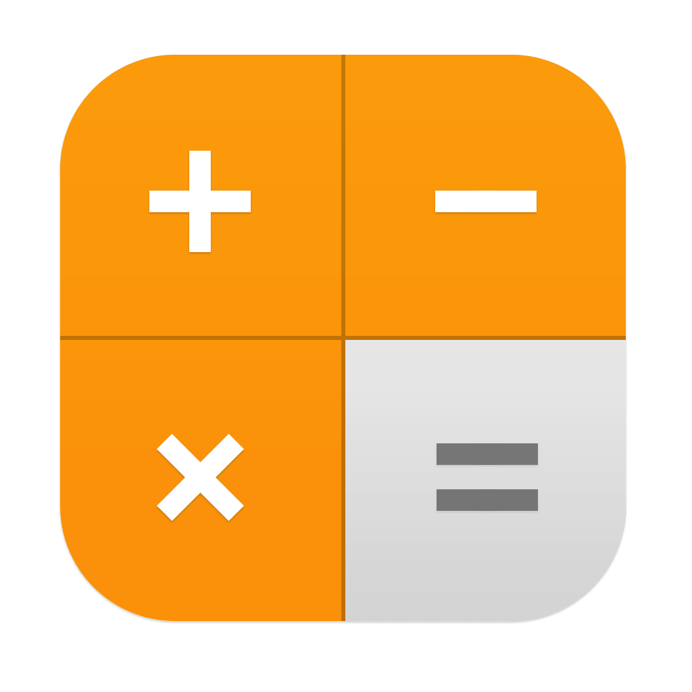

<div style="text-align:center"></div>

# Calculadora


## Descrição do Projeto

Esta é uma implementação de uma calculadora inspirada na calculadora do iPhone. O projeto foi desenvolvido em Python usando a biblioteca Flet para a interface gráfica.

- Eu não sou o criador deste projeto, ele foi replicado com o intúito de exercitar meus conhecimentos em python e conhecer a biblioteca flet, o criador desse projeto é o [Programador Aventureiro](https://github.com/Programador-Aventureiro)

## Instalação

Para executar a Calculadora, siga os passos abaixo:

1. Ative o ambiente virtual (recomendado):

   ```bash
   python3 -m venv .venv
   ```
   
   ```bash
   source .venv/bin/activate
   ```
2. Instale as dependências do projeto:

   ```bash
   pip install -r requirements.txt
   ```

3. Execute o arquivo principal `calculadora.py`:

   ```bash
   python calculadora.py
   ```

## Uso

A Calculadora oferece uma interface simples e familiar. Você pode realizar operações de adição, subtração, multiplicação e divisão, bem como cálculos percentuais e alterar o sinal dos números. Os resultados são exibidos na tela central.
